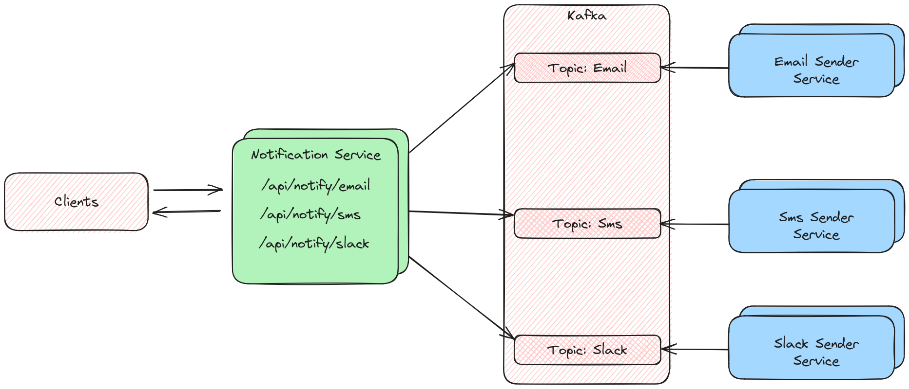

### High level architecture

- Clients are browsers/user devices that send the notification requests to the system.
- Notification service is responsible for accepting POST requests to its api. They contain all the information (in both the URL and Post Data Payload) for sending the notifications later on. The notification service also writes/produces kafka events to the appropriate topics.
- There is a separate kafka topic for each channel - email, sms, slack. Message data is stored in those topics in the appropriate json format. For email there might be special properties like - title, attachment. For sms a phone number is required, but there is no title. The kafka producer is confiured so that it waits for all in-sync replicas to commit before responding - sarama.WaitForAll.
- For each channel there is a separate microservice. That way they can be horizontally scaled separately and if there is a lot more load on emails more nodes can be added only for that channel. Each sender service is only responsible for the events in its dedicated kafka topic.
- To be able to scale sender services so that they can access simultaniously the same topic - [Kafka Consumer Groups](https://docs.confluent.io/platform/current/clients/consumer.html#consumer-groups) are used.
- The load balancer (not shown on the diagram) sits infront of the api and is responsible for terminating TLS and routing trafic to the Notification service using some scheme like Round Robin.

### Basic workflow
- Client makes request to the Notification Service via the Load Balancer to send an email - /api/notify/email
- Notification Service produces kafka event to the "email" topic and returns success to the client (at this point the notification is only queued and not yet sent, sending happens asynchronous)
- Email Sender Service grabs the newly created event from the email topic and sends it. After that it marks the event as commited, so that it is not sent again by some other service later on.

### Running locally
- Clone repo
- Install Kafka and run with ZooKeeper - [Kafka Quick Start](https://kafka.apache.org/quickstart)
- Run Notification service
    - cd cmd/notification-service && go run main.go
- Run Sender services
    - cd cmd/email-sender-service && go run main.go
    - cd cmd/slack-sender-service && go run main.go
    - cd cmd/sms-sender-service && go run main.go
- To test out basic notification sending open [http://localhost:8100/](http://localhost:8100/) and use the forms.

### Adding a new channel
- Add new micoservice - {channelName}-sender-service/main.go to the cmd similar to email-sender-service
- Add data model {channelName}/{channelName}-notification.go and sender {channelName}/sender.go in pkg  similar to pkg/email/
- Add api endpoint - http.HandleFunc("/notify/{channelName}", notification.{channelName}NotificationHandler)
- Add corresponding api handler in pkg/notification/handlers similar to - EmailNotificationHandler